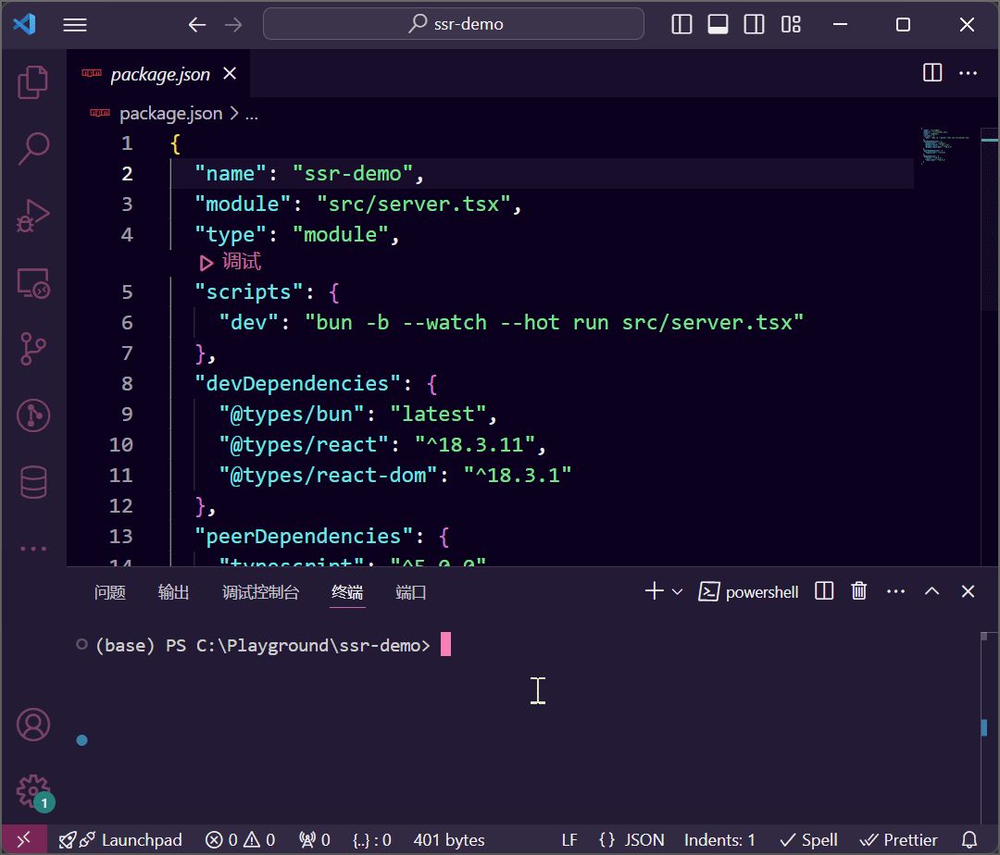
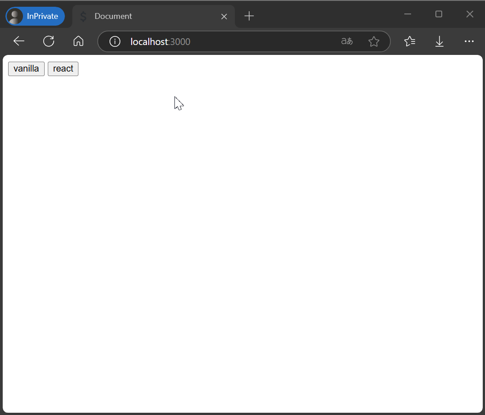
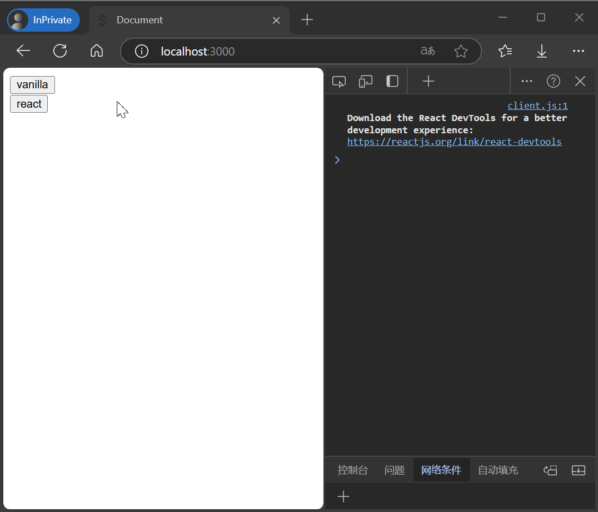

## 1. 什么是服务端渲染❓

服务器端渲染（SSR，Server-Side Rendering）指的是一种网页渲染技术，在这种技术中，网页的内容在服务器端生成并发送到客户端。与传统的客户端渲染（CSR，Client-Side Rendering）相比，服务器端渲染（以下简称 SSR）在页面加载时可以提供更快的初始内容展示和更佳的用户体验。

- *优势*：

    1. **SEO 友好**：由于页面内容在服务器端生成，搜索引擎爬虫能够更容易地索引这些页面，有助于提高搜索引擎优化（SEO）效果；
    2. **首屏加载速度快**：由于服务器返回的是完整的 HTML，用户在加载页面时可以更快地看到内容，提升了首屏加载的速度；
    3. **兼容性好**：SSR 通常可以更好地支持不支持 JavaScript 的浏览器，因为页面在服务器端就已经渲染好了。

- *适用场景*：

    1. **内容驱动的网站**；
    2. **对首屏加载速度敏感的应用**。

- *一些支持 SSR 的框架*：

    1. **[Next.js](https://nextjs.org/)**；
    2. **[Nuxt.js](https://nuxt.com/)**；
    3. **[SvelteKit](https://kit.svelte.dev/)**。

## 2. 实践🪄

:::tip[提示]
您可以在[这里](https://github.com/ZDSJdeJT/ssr-demo)找到所有代码。
:::

### 2.1 初始化项目

#### 2.1.1 前置工作

```bash
# 创建项目文件夹
mkdir ssr-demo

# 进入项目文件夹
cd ssr-demo

# 初始化为 bun 项目
bun init -y

# 安装依赖
bun install --no-cache
bun install react react-dom --no-cache
bun install @types/react @types/react-dom -D --no-cache
```

#### 2.1.2 实现 Web 服务

删除 `index.ts`，创建 `src` 文件夹并在 `src` 文件夹下创建 `server.tsx`。

```typescript title="src/server.tsx"
import type { Serve } from "bun";

export default {
  async fetch(req) {
    const url = new URL(req.url);
    switch (url.pathname) {
      case "/":
        return new Response(
          `<!DOCTYPE html>
<html lang="en">
<head>
  <meta charset="UTF-8">
  <meta name="viewport" content="width=device-width, initial-scale=1.0">
  <link rel="icon" href="/favicon.ico" type="image/x-icon" />
  <title>Document</title>
</head>
<body>
  <button type="button" onclick="this.innerText = this.innerText.repeat(2)">vanilla</button>
</body>
</html>`,
          {
            headers: {
              "Content-Type": "text/html",
            },
          },
        );
      default:
        return Response.redirect("/");
    }
  },
} satisfies Serve;
```

如你所见，目前我们只是使用 Bun 完成了一个简单的服务器。启动服务后使用浏览器访问服务，页面会渲染出一个 `vanilla` 按钮，点击后按钮的文本将显示为原来的两倍。

#### 2.1.3 修改 `package.json`

```json title="package.json" del={3} ins={4, 6-8}
{
  "name": "ssr-demo",
  "module": "index.ts",
  "module": "src/server.tsx",
  "type": "module",
  "scripts": {
    "dev": "bun -b --watch --hot run src/server.tsx"
  },
  "devDependencies": {
    "@types/bun": "latest",
    "@types/react": "^18.3.11",
    "@types/react-dom": "^18.3.1"
  },
  "peerDependencies": {
    "typescript": "^5.0.0"
  },
  "dependencies": {
    "react": "^18.3.1",
    "react-dom": "^18.3.1"
  }
}
```

#### 2.1.4 测试运行



看起来一切正常😎，让我们继续吧！

### 2.2 实现 React 的服务器端渲染

#### 2.2.1 创建一个 React 组件

在 `src` 文件夹下创建 `App.tsx`。

```typescript title="src/App.tsx"
import { useState } from "react";

export const App = () => {
  const [title, setTitle] = useState("react");

  return (
    <button
      type="button"
      onClick={() => {
        setTitle(title.repeat(2));
      }}
    >
      {title}
    </button>
  );
};
```

我们用 React 实现了一个和 `vanilla` 按钮逻辑相同的按钮组件，只是按钮的文本有所不同。下一步就该把这个组件也渲染在页面上了，那么，该怎么做呢🤔？

#### 2.2.2 渲染 React 组件

答案就是使用 React 提供的 [`renderToString`](https://react.dev/reference/react-dom/server/renderToString) 函数，通过它我们可以获取到组件运行后的 HTML。

```typescript title="src/server.tsx" {2, 22}
import type { Serve } from "bun";
import { renderToString } from "react-dom/server";

import { App } from "./App";

export default {
  async fetch(req) {
    const url = new URL(req.url);
    switch (url.pathname) {
      case "/":
        return new Response(
          `<!DOCTYPE html>
<html lang="en">
<head>
  <meta charset="UTF-8">
  <meta name="viewport" content="width=device-width, initial-scale=1.0">
  <link rel="icon" href="/favicon.ico" type="image/x-icon" />
  <title>Document</title>
</head>
<body>
  <button type="button" onclick="this.innerText = this.innerText.repeat(2)">vanilla</button>
  ${renderToString(<App />)}
</body>
</html>`,
          {
            headers: {
              "Content-Type": "text/html",
            },
          },
        );
      default:
        return Response.redirect("/");
    }
  },
} satisfies Serve;
```

#### 2.2.3 测试运行



React 组件正确渲染在页面上了🥳！等等，好像不太对🤡，点击事件貌似没有生效，这是怎么回事呢？

原因在于浏览器只收到了 React 组件运行后的 HTML 代码，没有收到将点击事件绑定在 React 组件上的 JavaScript 代码。我们将目前的 React 组件的状态称之为“脱水”状态。接下来，我们将实现“水合”以让 React 组件可以正常响应点击事件。

#### 2.2.4 “水合”

React 同样提供了相应的 API，即 [`hydrateRoot`](https://react.dev/reference/react-dom/client/hydrateRoot)，它的第一个参数为 React 组件在服务端渲染的根节点 DOM，第二个参数为要渲染的 React 组件。

在 `src` 文件夹下创建 `client.tsx`。

```typescript title="src/client.tsx" {1, 5}
import { hydrateRoot } from "react-dom/client";

import { App } from "./App";

hydrateRoot(document.getElementById("react-app")!, <App />);
```

`client.tsx` 无法直接在浏览器上运行，因此我们需要进行编译和打包，幸运的是，Bun 内置了此功能。

```bash
bun build src/client.tsx --outdir=dist --minify
```

运行👆此命令后项目的根目录会生成 `dist` 文件夹，`dist` 文件夹下会生成浏览器可以直接运行的 `client.js`。

接下来，我们还需要给 React 组件添加一个根节点并在页面引入刚刚打包生成的 `client.js`。修改 `server.tsx`。

```typescript del={22} ins={23-24, 33-38}
import type { Serve } from "bun";
import { renderToString } from "react-dom/server";

import { App } from "./App";

export default {
  async fetch(req) {
    const url = new URL(req.url);
    switch (url.pathname) {
      case "/":
        return new Response(
          `<!DOCTYPE html>
<html lang="en">
<head>
  <meta charset="UTF-8">
  <meta name="viewport" content="width=device-width, initial-scale=1.0">
  <link rel="icon" href="/favicon.ico" type="image/x-icon" />
  <title>Document</title>
</head>
<body>
  <button type="button" onclick="this.innerText = this.innerText.repeat(2)">vanilla</button>
  ${renderToString(<App />)}
  <div id="react-app">${renderToString(<App />)}</div>
  <script type="module" src="/client.js"></script>
</body>
</html>`,
          {
            headers: {
              "Content-Type": "text/html",
            },
          },
        );
      case "/client.js":
        return new Response(Bun.file("./dist/client.js"), {
          headers: {
            "Content-Type": "text/javascript",
          },
        });
      default:
        return Response.redirect("/");
    }
  },
} satisfies Serve;
```

#### 2.2.5 测试运行



Everything is fine🍾!

:::note[注意]
您可以在[这里](https://ssr-demo-pa1d.onrender.com/)亲自体验示例（Thank you, [Render](https://render.com/)!）。
:::

## 3. 总结✨

通过本文，我们使用 Bun + React 实现了简单的 SSR。不难发现，其实 SSR 的本质就是相同的组件在服务端和客户端各运行一次，服务端通过运行组件得到 HTML 代码直接返回给客户端；客户端可以直接在页面上渲染出组件并通过运行组件将事件侦听器绑定在组件上（即“水合”），使得组件变得可交互。

当然，实际的场景往往更加复杂，不太可能只有两个简单的按钮，更深入的内容和应用场景仍需你自己去探索。希望本文能帮助你大致理解 SSR 的实现原理，并激发你在此领域的进一步研究！
