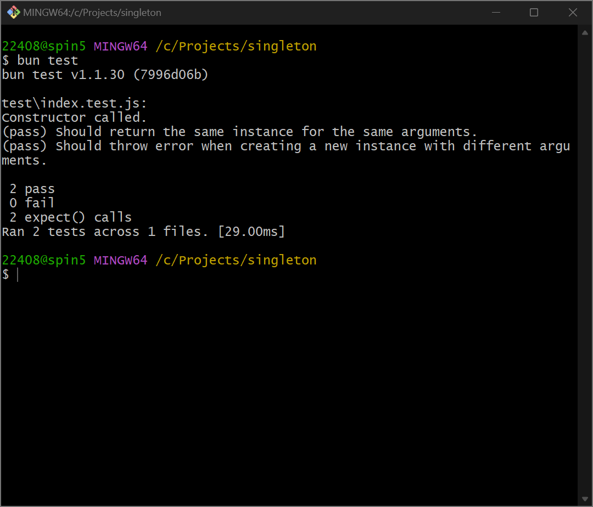

## 1. 什么是单例模式❓

[单例模式](https://refactoringguru.cn/design-patterns/singleton)（Singleton Pattern）是一种设计模式，其目的是确保某个类**只有一个实例**，并提供一个**全局访问点**来获取该实例。它在某些场景中非常有用，例如配置管理器、日志记录器、数据库连接等。在这些场景中，保证只有一个实例存在可以避免资源浪费和不一致性等问题。

## 2. 在 JavaScript 中使用 Proxy 实现单例模式🤌

单例模式的实现思路在大部分语言中都是将构造函数私有化并向外暴露一个返回实例的方法，但是在 JavaScript 中，情况有所不同——JavaScript 不支持将构造函数私有化。所以，如果你想在 JavaScript 中使用单例模式，我推荐使用 [Proxy](https://developer.mozilla.org/zh-CN/docs/Web/JavaScript/Reference/Global_Objects/Proxy) 来实现。通过使用 Proxy，我们可以拦截类的构造函数以实现单例模式，以下👇是示例代码。

```javascript title="singleton.js"
export const singleton = (clazz) => {
  const meta = {
    instance: null,
    args: [],
  };
  return new Proxy(clazz, {
    construct(target, args) {
      if (!meta.instance) {
        meta.instance = new target(...args);
        meta.args = args;
      }
      if (args.length > 0 && !Bun.deepEquals(meta.args, args, true)) {
        throw new Error("Instance already created with different arguments.");
      }
      return meta.instance;
    },
  });
};
```

```javascript title="something.js"
import { singleton } from "./singleton";

export const Something = singleton(
  class {
    arg0;

    arg1;

    constructor(arg0, arg1) {
      this.arg0 = arg0;
      this.arg1 = arg1;
      console.info("Constructor called.");
    }
  }
);
```

---

让我们写个测试用例测试一下吧😀！

```javascript title="index.test.js"
import { expect, test } from "bun:test";

import { Something } from "../src/something";

test("Should return the same instance for the same arguments.", () => {
  const foo = new Something(0, "0");
  const bar = new Something();
  expect(foo).toBe(bar);
});

test("Should throw error when creating a new instance with different arguments.", () => {
  expect(() => {
    new Something(1, "1");
  }).toThrowError("Instance already created with different arguments.");
});
```

运行测试用例😎！

```bash
bun test
```



看起来一切正常✔️！

## 3. 总结✨

单例模式确保了类只有一个实例，并通过全局访问点来获取该实例。在 JavaScript 中，由于语言特性限制，无法像其他语言那样直接私有化构造函数，但是通过使用 Proxy，我们可以拦截对象创建的行为，以实现单例模式。这种方式不仅实现了单例模式，还灵活地运用了 JavaScript 的特性。
