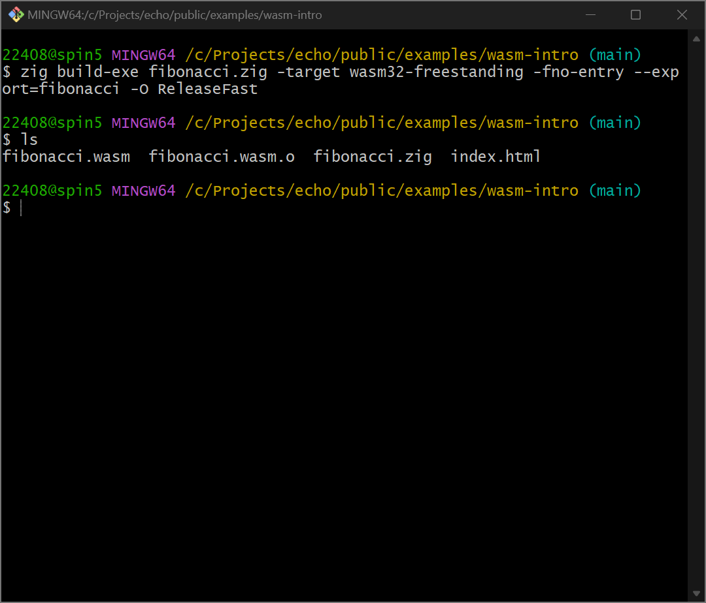

## 1. 什么是 WebAssembly❓

[WebAssembly](https://developer.mozilla.org/zh-CN/docs/WebAssembly)（简称 wasm）是一种新型的编码方式，它允许开发者在浏览器中运行近乎原生速度的代码。与 JavaScript 代码相比，WebAssembly 可以显著提升性能，特别是在处理 CPU 密集型任务的场景中。


## 2. 实践🪄

最近，由于 [Bun](https://bun.sh/) 的出圈，我对 [Zig](https://ziglang.org/) 语言产生了浓厚的兴趣🧐。因此，我决定选择 Zig 作为源代码语言来进行实践。算法我选了经典的计算斐波那契数列的第 n 个数。

### 2.1 编写 Zig 代码

```zig title="fibonacci.zig"
export fn fibonacci(n: u32) u32 {
    return if (n <= 1) n else fibonacci(n - 1) + fibonacci(n - 2);
}
```

### 2.2 编译为 WebAssembly

```bash
zig build-exe fibonacci.zig -target wasm32-freestanding -fno-entry --export=fibonacci -O ReleaseFast
```



我们成功得到了 wasm 文件😊！

## 3. 性能对比⚔️

### 3.1 编写测试代码

```html title="index.html"
<!DOCTYPE html>
<html lang="zh-CN">

<head>
    <meta charset="UTF-8">
    <meta name="viewport" content="width=device-width, initial-scale=1.0">
    <title>WebAssembly 初探👀</title>
    <script type="module">
        const fibonacci = n => n <= 1 ? n : fibonacci(n - 1) + fibonacci(n - 2)

        const cases = [{
            label: "js",
            fn: fibonacci,
        }, {
            label: "wasm",
            fn: (await WebAssembly.instantiateStreaming(fetch("./fibonacci.wasm"))).instance.exports.fibonacci,
        }]

        cases.forEach(({ label, fn }) => {
            console.time(label)
            for (let i = 1; i <= 40; i++) {
                fn(i)
            }
            console.timeEnd(label)
        })
    </script>
</head>

<body>
    <h1>WebAssembly 初探👀</h1>
</body>

</html>
```

### 3.2 启动 Web 服务

```bash
npx serve -s
```

### 3.3 查看运行结果


运行结果真令人震惊😮！就这个例子而言，同样的逻辑、同样的计算量，WebAssembly 的运行时间差不多只有 JavaScript 的 20%！要知道，WebAssembly 在运行时还会有额外的上下文转换、序列化和反序列化等性能开销。

如果你对运行结果表示怀疑的话，请务必亲自<a href="/examples/wasm-intro/index.html" target="_blank">查看</a>！

## 4. 总结✨

通过使用 WebAssembly，我们获得了比 JavaScript 更优越的执行效率。值得一提的是，我们同样可以在服务端使用 WebAssembly，这可以大大弥补 Node.js 等 JavaScript 运行时不“擅长”处理 CPU 密集型任务的短板。在需要高性能计算的应用中，WebAssembly 将成为提升性能的终极利器。
